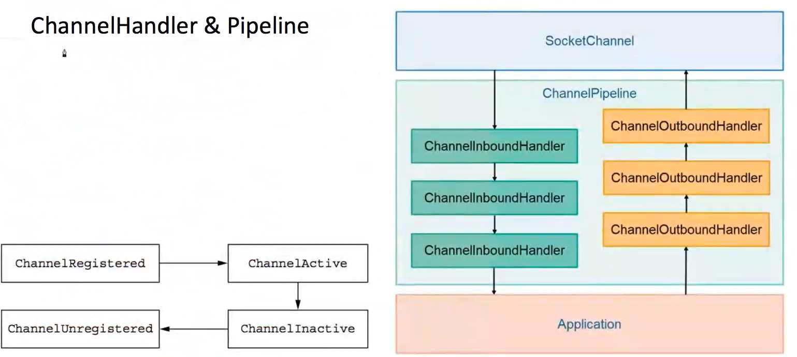

# netty的深入学习

本次学习将从以下部分入手

* 网络编程基础
  * Tcp协议
  * Socket协议
  * BIO & NIO
  * Reactor模式

* Netty

  * Netty核心组件介绍
  * Netty部分源码分析
  * 处理粘包


## TCP协议

​	TCP是一种面向**连接**的、**可靠**的、基于**字节流**的传输层通信协议。

* tcp与http不同，tcp是基于字节流的，将数据转成一个个封包发送，而http是一次性将所有数据发送，当成一个请求。

* 为什么要有“连接”?“连接”究竟是什么?

* Byte stream oriented vs Message oriented


### 为什么要有连接？连接究竟是什么？

* 为什么要有连接？

  因为网络连接是不可靠的，难免出现丢包或者包发送的时间顺序错误。网络传输不像是打电话是点到点的，必须考虑这些问题。

* 连接是什么？

  连接是一种传输协议，或者是一种校验机制。需要进行数据共享的双方通过某种协议进行数据的交换，这样的行为称之为连接。

  eg：例如我们打电话，通话不畅，我们就会问对方听到了吗，直到听到了我们才继续讲要说的事。tcp也是这样，中间这个校验过程用的是什么方法，就是什么协议。

下面来讲一讲tcp协议：

* 早期tcp协议：当数据包发送到 服务器后，服务器需要发送ack请求返回客户端进行确认，确认后再进行下一个包的发送。
  * 存在问题：效率低下，一次请求一个包，实在太慢了。
* 批处理的tcp协议：一次发送多个数据，当全部数据接受到后返回末尾数据包的数值。例如，发送数据1、2、3，当服务器全部接受到后返回ack=3。当数据包出现问题后则回退N步，客户端会重新发送1、2、3数据包回来，直到收到了ack=3的命令。
  * 回退N步（目前使用）：使用的是滑动窗口协议，每次发送指定数量的数据包，服务器端收到后，返回ack=对应数值，然后再进行下一次发送。如果发送失败，则客户端重新再次发送所有的数据包。
  * 选择性重发：哪个数据包发送失败，就重新发送哪个数据包。


​	受当时的技术水平影响，当时普遍认为选择性重发的实现比回退N步来说更难，所以选择了回退N步充当tcp的交换协议。

​	滑动窗口协议：发送使用的算法是滑动窗口，当1、2、3发送后，我们收到了ack=3，则滑动窗口到4，继续下个窗口。窗口大小则是每次我们发送的数据包大小。


实际使用中，为了防止被窃取信息，起始序号都是随机的。

### tcp的三次握手

* 为什么要三次？而不是两次或四次？

  三次是保证双方互相明确对方能收能发的最低值。理论上讲不论握手多少次都不能确认一条信道是“可靠”的，但通过3次握手可以至少确认它是“可用”的，再往上加握手次数不过是提高“它是可用的”这个结论的可信程度。

  简单来说：三次握手应该叫双向握手，双向确认的过程。

  eg：举个例子，我追小露，小露特别乖又体贴，我很担心别人抢走她，所以我想让她当我女朋友。（发起请求）

  第一次握手：我喜欢你呀balabalabal.....做我女朋友好不啦。

  第二次握手：可以呀，balabalabal......但是balabalabala，这样的话，你还喜欢我吗？（接受请求，但不确定对方是否会接收到确认请求，所以必须要对方再次确认才可以知道）

  第三次握手：当然喜欢了，balabalabal......（此时就达成了双向握手+双向确认的情况）

* 三次握手过程

  * SYN(synchronous 建立连接) 
  * ACK(acknowledgement 确认) 
  * Sequence number(顺序号码) 

  1、浏览器发送数据包给服务器，数据包里面包含 SYN=1(表示建立连接)，Seq（身份码） 

  2、服务器发送数据包给浏览器，数据包包含 ACK=1（表示确认建立连接）， ack=seq+1（表 

  示确认身份）和 SYN=1(表示建立连接)，Seq（身份码） 

  3、浏览器发送数据包给服务器，数据包包含 ACK=1,ack=seq+1，完成建立连接。

### tcp四次挥手

1、浏览器发送数据包给服务器，数据包里面包含 FIN=1（请求断开连接），Seq（身份码）

 2、服务器发送数据包给浏览器，数据包含 ACK=1（表示确认断开连接）,ack=Seq+1（表示确 认身份）和自己的 Seq（身份码），此时处于等待关闭状态。 

3、服务器发送数据包给浏览器，数据包含 FIN=1（请求断开连接）和自己的 Seq（身份码）， 此时处于最后确认状态。 

4、浏览器发送数据包给服务器，数据包含 ACK=1（表示确认断开连接）和 ack=Seq+1，此时 连接关闭

### Socket API

​	这边拿服务端举例，这是伯克利大学的一个教授所做，所以也有人把它称之为伯克利套字节。

* Socket()：初始化socket
* Bind()：绑定一个端口
* Listen()：监听端口。
* Accept()：完成连接的建立，Accept()这个过程就是显性的从接收队列里拿封包的过程。这个过程中服务器端需要维护两个队列。
  * sync queue：将接收到的连接放到队列里面去。
  * accept queue：将完成的连接放到这个队列里去。

* Read()/Write():可以给对方发消息或者接收消息。
* Close():关闭连接。

从listen到Accept这个过程就发生了三次握手。


## BIO&NIO

java存在的Socket，以下是它API的类：

* BIO
  * ServerSocket
  * Socket
* NIO
  * ServerSocketChannel
  * SocketChannel

### BIO 

#### 案例 

模拟一段BIO服务器端进行Socket编程：

```java
public class BIOServer {
    public static void start(int port) throws IOException {
        //1、建立socket连接
        ServerSocket serverSocket = new ServerSocket();
        //2、绑定和监听
        serverSocket.bind(new InetSocketAddress(port),2);
        //支持连接的端口号和连接数
        //3、起线程跑连接，或者用线程池。
        while (true){
            final Socket clientSocket = serverSocket.accept();
            System.out.println("accept");//标识接收到了请求
            new Thread(()->{
                try {
                    BufferedReader in = new BufferedReader(new InputStreamReader(clientSocket.getInputStream()));
                    PrintWriter out = new PrintWriter(clientSocket.getOutputStream(),true);
                    String line = in.readLine();//阻塞
                    while(line !=null){
                        out.println(line);
                        out.flush();
                        line=in.readLine();
                    }
                    clientSocket.close();
                } catch (IOException e) {
                    e.printStackTrace();
                }

            });
        }
    }

    public static void main(String[] args) throws IOException {
        start(2020);
    }
}
```

启动cmd然后和我们的程序建立连接：

```shell
telnet localhost 2020
```

然后执行cmd命令发现成功：


#### 阻塞分析

红色部分代表了阻塞，下面解释一下阻塞的原因：

* accept:阻塞是因为网络传输的问题等
* read&parse:需要解决字节边界问题，需要截取每个请求需要的字节。当收不到请求字节了，就要切换线程。当发送的请求断断续续的，每次接收一点就要切换一次后，阻塞就会非常严重。
* write:接收方有缓存大小，类似于窗口大小，当接收到足够的数据包才会写出去。例如，需要数据包为1-5，但只接受到了2-5，那我们会一直堵塞，直到得到数据包1。


tcp也有自己的一套流量控制和拥塞控制算法，所以tcp天生拥有背压能力，能够很天然的适应流量弹性的变化。	

#### 缺点

​	上下文切换：在read&parse过程中，我们需要去切割字节，获取到对应的请求，但如果此时网络不畅，那么我们接收到的封包就会断断续续的，过了一段时间后就会切换下个线程。

​	eg：如果A线程需要的数据是0-100，我的线程是A,B,C。刚开始A线程接收到50个数据，接下去因为网络原因无法接受到了，所以切换到了B或者C线程。这时候如果又来了10个A所需的数据又要切换到A接收，这样非常浪费时间。


总结：可以发现，当我们的连接数多了，我们传统的blocking的服务器模型，效率就很低了。为了解决BIO的上下文切换存在的问题，我们引出了NIO

### NIO

​	核心目标：减少线程数，减少上下文切换问题。

​	解决办法：将accept、read&parse、write放入更为底层的部分，放入到一个线程中，由一个线程去统筹其他的线程来执行这些操作。比如说，当网络断断续续后，这个线程可以通知正在read过程中被阻塞的线程别阻塞了，切换到其他的Socket线程进行读。

下面是NIO的模型，采用操作系统事件的机制，我们将统筹所有连接的线程称之为Selector：

#### 模型解释

​	负责多个Socket连接，当Socket的状态发生变化了，都会通知Selector。Selector会对所有的连接进行轮询（定时任务），做对应事件的事情，所以不会涉及到任何的浪费。


#### Selector API

* channel.register(selector) ：注册监听
* while(true)+ select()：轮询事件
* selectedKeys()：获得selectionKey对象，表示channel的注册信息
* SelectionKey.attach()对selectionkey：关联任何对象
* isReadable()/ isAcceptable()/ isWritable()：判断事件类型
* 事件类型：OP_ACCEPT/OP_READ/OP_WRITE/OP_CONNECT

 #### 整体步骤

* 把想要被Selector监听的ServerSocket注册到channel上
* 无限轮询，然后去查看Socket的状态
* 一旦轮询到需要的对象，使用selectedKeys去获取对象
* 根据事件类型（ACCEPT、READ、WRITE、CONNECT），根据这四种状态去进行相应的操作。

#### 案例

​	举例说明下步骤，一共七步走，

* 第一步：创建一个信道
* 第二步：设置是否阻塞并设置端口号，这里要用NIO肯定是非阻塞的
* 第三步：同BIN过程，绑定套接字地址,这里可以绑定多个，只要在后面加上.bin即可
* 第四步：创建selector并绑定事件
* 第五步：进行轮询，查看是否有注册过channel的状态得到了满足
* 第六步：从selector中得到集合，但也有可能Socket状态都没改变，集合为空
* 第七步：进入事件处理三步走
  * 从信道中获取连接
  * 同BIO过程，对其进行accept
  * 设置连接非阻塞，并且转换连接的状态

```java
public class NIOServer {
    public static void start(int port) throws IOException {
        //1、创建一个信道
        ServerSocketChannel serverSocketChannel = ServerSocketChannel.open();
        //2、设置是否阻塞并设置端口号，这里要用NIO肯定是非阻塞的
        serverSocketChannel.configureBlocking(false);
        InetSocketAddress address = new InetSocketAddress(port);
        //3、同BIN过程，绑定套接字地址,这里可以绑定多个，只要在后面加上.bin即可
        serverSocketChannel.bind(address);
        //4、创建selector并绑定事件
        Selector selector = Selector.open();
        serverSocketChannel.register(selector, SelectionKey.OP_ACCEPT);
        while(true){ //这里如果只请求一次不会出错
            //5、进行轮询，查看是否有注册过channel的状态得到了满足
            //但是这块底层会有一些bug，因为非阻塞，所以while会空转
            selector.select();
            //6、从selector中得到集合，但也有可能Socket状态都没改变，集合为空
            Set<SelectionKey> readyKeys = selector.selectedKeys();
            Iterator<SelectionKey> it = readyKeys.iterator();
            //7、进入事件处理三步走
            while (it.hasNext()){ //进入事件处理三步走
                SelectionKey key = it.next();
                if (key.isAcceptable()){
                    //(1)、从信道中获取连接
                    ServerSocketChannel server = (ServerSocketChannel) key.channel();
                    //(2)、同BIO过程，对其进行accept
                    SocketChannel socket = server.accept();
                    System.out.println("Accept !");
                    //(3)、设置连接非阻塞，并且转换连接的状态
                    socket.configureBlocking(false);
                    socket.register(selector,SelectionKey.OP_READ);//将其从accept转换成read
                    System.out.println("经历了一次状态转换过程");
                }
                if (key.isReadable()) {
                    //(1)、从信道中获取连接
                    SocketChannel socket = (SocketChannel) key.channel();
                    //(2)创建字节流，接受传入的流
                    final ByteBuffer buffer =ByteBuffer.allocate(64);
                    final  int bytesRead =socket.read(buffer);//读取流
                    if (bytesRead>0){
                        buffer.flip();//翻转缓冲区，理解成刷新缓存
                        int ret =socket.write(buffer);
                        if (ret<=0){
                            socket.register(selector,SelectionKey.OP_WRITE);
                        }
                        buffer.clear();
                    } else  if (bytesRead<0){
                        key.cancel();
                        socket.close();
                        System.out.println("Client close");
                    }
                }
                it.remove();
            }
        }
    }
    public static void main(String[] args) throws IOException {
        start(2020);
    }
}
```

测试一下，运行程序，打开cmd连接端口号：

```shell
telnet localhost 2020
```

查看结果：


这里会存在一个问题，因为NIO非阻塞，所以当没接收到Socket连接的时候会存在空转问题，空转就是while(true)就会一直执行，直到吧内存占满。

#### 缺点

* 空转问题(会报错):因为NIO是非阻塞的，所以当没有请求后，也不会阻塞。此时while(true)就会一直执行，直到吧内存占满。

* 代码不好复用，如果我需要实现某一功能并没有BIO那么容易，也不好抽取出来成单独模块。

  虽然NIO有缺点，但NIO的非阻塞和单线程处理Socket对效率的提升而言非常大，所以我们还是得用。往后我们就引入了**Reactor模式**，即**响应式编程**。

### Reactor

​	Reactor是响应式编程，**响应式编程（RP）是一种基于异步数据流概念的编程范式**。而**RP**的精髓也在于对数据流（Dataflow， Event）的高效处理。

#### 单Reactor单线程模型

​	消息处理流程：

* Reactor对象通过select监控连接事件，收到事件后通过dispatch进行转发。
* 如果是连接建立的事件，则由acceptor接受连接，并创建handler处理后续事件。
* 如果不是建立连接事件，则Reactor会分发调用Handler来响应。
* handler会完成read->业务处理->send(就是write)的完整业务流程。


##### 案例

```java
public class Reactor {
    interface ChannelHandler {
        public void onRead(SocketChannel channel) throws Exception;
        public void onAccept();
    }
    private static ChannelHandler echo =new ChannelHandler() {
        @Override
        public void onRead(SocketChannel socket) throws Exception {
            final ByteBuffer buffer = ByteBuffer.allocate(256);
            final int bytesRead = socket.read(buffer);
            if (bytesRead >0){
                buffer.flip();
                socket.write(buffer);
                buffer.clear();
            }else  if(bytesRead<0){
                socket.close();
                System.out.println("client close");
            }
        }
        @Override
        public void onAccept() {}
    };
    public static void start(int port) throws Exception{
        //因为是单reactor单线程，所以只有一个信道
        final   ServerSocketChannel serverSocketChannel = ServerSocketChannel.open();
        //设置非阻塞并且注册端口
        serverSocketChannel.configureBlocking(false);
        InetSocketAddress address = new InetSocketAddress(port);
        serverSocketChannel.bind(address);
        final Selector selector =Selector.open();
        SelectionKey sk = serverSocketChannel.register(selector, SelectionKey.OP_ACCEPT);
        //连接进来后先进行accept操作
        sk.attach(new ChannelHandler() {
            @Override
            public void onRead(SocketChannel channel) throws Exception {}

            @Override
            public void onAccept() {
                try {
                    SocketChannel socket = serverSocketChannel.accept();
                    System.out.println("Accept ！");
                    System.out.println("接受的socket:"+socket);
                    socket.configureBlocking(false);
                    SelectionKey sk = socket.register(selector, 0);
                    sk.attach(echo);
                    sk.interestOps(SelectionKey.OP_READ);
                } catch (IOException e) {
                    e.printStackTrace();
                }
            }
        });
        while (true){ //循环判断状态，根据状态进行操作
            selector.select();
            Set<SelectionKey> readKeys = selector.selectedKeys();
            Iterator<SelectionKey> it = readKeys.iterator();
            while(it.hasNext()){
                SelectionKey key = it.next();
                ChannelHandler handler = (ChannelHandler) key.attachment();
                if (key.isAcceptable()){
                    handler.onAccept();
                }
                if (key.isReadable()){
                    handler.onRead((SocketChannel) key.channel());
                }
                it.remove();
            }
        }
    }
    public static void main(String[] args) throws Exception {
        start(2020);
    }
}
```

##### 缺点

* 即便Reactor线程的CPU负荷达到100%，也无法满足海量消息的编码、解码、读取和发送。
* 当Reactor线程负载过重之后，处理速度将变慢，这会导致大量客户端连接超时，超时之后往往会进行重发，这更加重Reactor线程的负载，最终会导致大量消息积压和处理超时，成为系统的性能瓶颈。
* 一旦Reactor线程意外中断或者进入部消息，造成节点故障。

总结：当处理的行为单次消耗时间过多，或者行为量过多，又或者单个线程出现了故障就会单Reactor单线程模型出现问题的情况。

####  单Reactor多线程模型

​	该模型在事件处理器（Handler）部分采用了多线程（线程池）


​	消息处理流程：

* Reactor对象通过Select监控客户端请求事件，收到事件后通过dispatch进行分发。

* 如果是建立连接请求事件，则由acceptor通过accept处理连接请求，然后创建一个Handler对象处理连接完成后续的各种事件。

* 如果不是建立连接事件，则Reactor会分发调用连接对应的Handler来响应。

* Handler只负责响应事件，不做具体业务处理，通过Read读取数据后，会分发给后面的Worker线程池进行业务处理。

* Worker线程池会分配独立的线程完成真正的业务处理，如何将响应结果发给Handler进行处理。

* Handler收到响应结果后通过send将响应结果返回给Client。

  相对于第一种模型来说，在处理业务逻辑，也就是获取到IO的读写事件之后，交由线程池来处理，handler收到响应后通过send将响应结果返回给客户端。这样可以降低Reactor的性能开销，从而更专注的做事件分发工作了，提升整个应用的吞吐。

##### 缺点

* 多线程数据共享和访问比较复杂。如果子线程完成业务处理后，把结果传递给主线程Reactor进行发送，就会涉及共享数据的互斥和保护机制。
* Reactor承担所有事件的监听和响应，只在主线程中运行，可能会存在性能问题。例如并发百万客户端连接，或者服务端需要对客户端握手进行安全认证，但是认证本身非常损耗性能。

总结：线程间的通信会涉及到数据的互斥和保护机制，单Reactor需要承担所有的事件监听和响应，且只在主线程里面做，当请求的连接到达了百万级，可能会出现宕机等事。

#### 主从Reactor多线程模型

​	比起第二种模型，它是将Reactor分成两部分：

* mainReactor负责监听server socket，用来处理网络IO连接建立操作，将建立的socketChannel指定注册给subReactor。
* subReactor主要做和建立起来的socket做数据交互和事件业务处理操作。通常，subReactor个数上可与CPU个数等同。

Nginx、Swoole、Memcached和Netty都是采用这种实现。


​	消息处理流程：

* 从主线程池中随机选择一个Reactor线程作为acceptor线程，用于绑定监听端口，接收客户端连接
* acceptor线程接收客户端连接请求之后创建新的SocketChannel，将其注册到主线程池的其它Reactor线程上，由其负责接入认证、IP黑白名单过滤、握手等操作
* 以上步骤完成之后，业务层的链路正式建立，将SocketChannel从主线程池的Reactor线程的多路复用器上摘除，重新注册到Sub线程池的线程上，并创建一个Handler用于处理各种连接事件
* 当有新的事件发生时，SubReactor会调用连接对应的Handler进行响应
* Handler通过Read读取数据后，会分发给后面的Worker线程池进行业务处理
* Worker线程池会分配独立的线程完成真正的业务处理，如何将响应结果发给Handler进行处理
* Handler收到响应结果后通过Send将响应结果返回给Client

##### 缺点

​	这是目前最好的一种模式，硬要说缺点的话只能是：

* 多线程切换在没有那么高并发的情况下，花销特别大。
* 需要的硬件配置比先前两个高了
* 并不好判断从哪里截取字节用来转译

#### 总结

Reactor模型具有如下的优点：

* 响应快，不必为单个同步时间所阻塞，虽然Reactor本身依然是同步的；
* 编程相对简单，可以最大程度的避免复杂的多线程及同步问题，并且避免了多线程/进程的切换开销；
* 可扩展性，可以方便地通过增加Reactor实例个数来充分利用CPU资源；
* 可复用性，Reactor模型本身与具体事件处理逻辑无关，具有很高的复用性。

### Netty

#### Netty核心概念

* Channel：对应NIO的SocketChannel

* EventLoop：对应NIO的Selector
* ChannelPipeline：业务逻辑
* ChannelHandler：业务逻辑
* Boostrap：可以选择阻塞或者非阻塞，可以选择有几个selector
* ByteBuffer：用来存储发送过来的字节
* Codec：  帮我们做编码解码工作

#### EventLoop

​	EventLoop=线程+selector，在nodeJs里面也有用到，EventLoop顾名思义就是不停的轮询。

* select()：原本的select()
* processSelectedKeys()：处理IO事件（最重要的地方）
* runAllTasks：处理应用层代码
* task queue：用于存放task，当存放的task和当前线程相符就会拿出来执行。

ps：特别注意，runAllTasks和processSelectedKeys不能用阻塞的代码。

整体模型如下图所示：


#### EventLoopGroup

为了提高更高的处理效率，引入了EventLoop组（selector的名字就叫多路复用），模型如下图所示：


#### ChannelHandler&Pipeline  

* ChannelHandle：进行事件的处理，例如channelRead或channelActive，ChannelHandle被分为了两种类型：
  * ChannellnboundHandler：处理对于程序而言，外部的事件
    * 内置头handleCtx：每个流程都得进过这个头结点的handle
    * 内置尾TailCtx：每个流程都得以TailCtx结束
  * ChannelOutboundHandler：处理对于程序而言，内部的事件

对于每个Handler，netty可以帮我们处理byteBuf或Message，处理好以后按原本的格式输出。

* ChannelPipeline（流水线）：里面包含了很多的Handle，是netty封装好的一个流水线。



#### 运行过程

整体过程：事件->selector->信道channel->流水線pipeline->走handler流程


#### 生命周期

* channelRegistered：注册事件
* channelActive：检查信道是否活跃
* channelInactive：信道不活跃
* channelUnregistered：取消注册的事件


#### 各组件之间的关系

* EVentLoopGroup和EventLoop：1对N，没什么讲的，就像线程和线程池一样
* EventLoop和Thread：1对1，为了保证执行的快，不会引起线程间的通信的问题
* EventLoop和Channel：1对N，轮询每个信道，这也就是为什么信道不能阻塞的原因，因为一旦阻塞，单线程的EventLoop就会一直等待到当前这个线程执行完毕
* Channel和ChannelPipeline：1对1，一个Channel只能有一个ChannelPipeline
* ChannelPipeline和ChannelHandle：1对N的关系，一个ChannelPipeline内有多个ChannelHandle参与流程
* ChannelHandle和ChannelPipeline：1对N，一个ChannelHandle可以被多个ChannelPipeline调用使用

#### 案例

​	学了那么多基础知识，写个案例巩固下，写完案例后着手开始源码学习。项目结构如下：


EchoHandler代码如下：

```java
/**
 * ChannelInboundHandlerAdapter 主动帮我们去使用下一个handler
 * 不用关注于下一个handler的执行
 */
public class EchoHandler extends ChannelInboundHandlerAdapter {
    @Override
    public void channelRead(ChannelHandlerContext ctx, Object msg)  {
        String in=(String) msg;
        ctx.channel().writeAndFlush(in);
        ReferenceCountUtil.release(msg);
    }
}
```

IProtocalHandler代码如下：

```java
public class IProtocalHandler extends ChannelInboundHandlerAdapter {

    @Override
    public void channelRead(ChannelHandlerContext ctx, final Object msg) throws Exception {
        int sleep = 500 * new Random().nextInt(5);
        System.out.println("sleep:" + sleep);
        Thread.sleep(sleep);

        final ByteBuf buf = (ByteBuf) msg;
        char c1 = (char) buf.readByte();
        char c2 = (char) buf.readByte();

        if (c1 != 'J' || c2 != 'W') {
            ctx.fireExceptionCaught(new Exception("magic error"));
            return ;
        }

        buf.readShort();//skip length

        String outputStr = buf.toString(CharsetUtil.UTF_8);
        System.out.println(outputStr);

        ctx.channel().writeAndFlush(outputStr+"\n");

    }
}
```

PipelinePrintHandler代码如下：

```java
/**
 * ChannelInboundHandlerAdapter 主动帮我们去使用下一个handler
 * 不用关注于下一个handler的执行
 */
public class PipelinePrintHandler extends ChannelInboundHandlerAdapter {
    @Override
    public void channelActive(ChannelHandlerContext ctx) throws Exception {
        super.channelActive(ctx);
        System.out.println(ctx.pipeline().names());
    }
}
```

PrintInboundHandler代码如下：

```java
public class PrintInboundHandler implements ChannelInboundHandler {
    private final String id ;

    public PrintInboundHandler(String id) {
        this.id = id;
    }

    public void handlerAdded(ChannelHandlerContext ctx) throws Exception {
        System.out.println("handlerAdded " + id);

    }

    public void handlerRemoved(ChannelHandlerContext ctx) throws Exception {
        System.out.println("handlerRemoved "+ id);

    }

    public void channelRegistered(ChannelHandlerContext ctx) throws Exception {
        System.out.println("channelRegistered "+ id);
        ctx.fireChannelRegistered();

    }

    public void channelUnregistered(ChannelHandlerContext ctx) throws Exception {
        System.out.println("channelUnregistered "+ id);
        ctx.fireChannelUnregistered();

    }

    public void channelActive(ChannelHandlerContext ctx) throws Exception {
        System.out.println("channelActive "+ id);
        ctx.fireChannelActive();

    }

    public void channelInactive(ChannelHandlerContext ctx) throws Exception {
        System.out.println("channelInactive "+ id);
        ctx.fireChannelInactive();
    }

    public void channelRead(ChannelHandlerContext ctx, Object msg) throws Exception {
        System.out.println("channelRead "+ id);
        ctx.fireChannelRead(msg);
        //ctx.channel().pipeline().fireChannelRead(msg);
    }

    public void channelReadComplete(ChannelHandlerContext ctx) throws Exception {
        System.out.println("channelReadComplete "+ id);
        ctx.fireChannelReadComplete();
    }

    public void userEventTriggered(ChannelHandlerContext ctx, Object evt) throws Exception {
        System.out.println("userEventTriggered "+ id);

    }

    public void channelWritabilityChanged(ChannelHandlerContext ctx) throws Exception {
        System.out.println("channelWritabilityChanged "+ id);

    }

    public void exceptionCaught(ChannelHandlerContext ctx, Throwable cause) throws Exception {
        System.out.println("exceptionCaught "+ id);

    }

}
```

Server代码如下：

```java
public class Server {

    private static  void use(ChannelPipeline pipeline, Consumer<ChannelPipeline> strategy){
        strategy.accept(pipeline);
    }
    private static Consumer<ChannelPipeline> echo= p ->{
        p.addLast(
                new LineBasedFrameDecoder(80,false,false), //按行分割String
                new StringDecoder(),//把bytr自动转成string
                new EchoHandler(), //自己写的
                new PipelinePrintHandler(),//自己写的
                new StringEncoder(StandardCharsets.UTF_8)//编码格式
        );
    };
    private  static Consumer<ChannelPipeline> print =p -> {
      p.addLast(
              new PrintInboundHandler("id1")
      );
    };

    private static  Consumer<ChannelPipeline> decode= p->{
      p.addLast(new LengthFieldBasedFrameDecoder(1024,2,2,-2,0))
        .addLast(new DefaultEventExecutorGroup(16),new IProtocalHandler())
        .addLast(new StringEncoder(CharsetUtil.UTF_8));
    };

    private static  void start(int port) throws InterruptedException {
        // bossGroups,是专门做accept功能用的，对应mainReactor，是负责接受接收的selector
        EventLoopGroup bossGroup = new NioEventLoopGroup();
        //workerGroup,对应read、send等其他操作，对应subreactor，是负责进行相应操作的selector
        EventLoopGroup workerGroup = new NioEventLoopGroup();
        try {
            ServerBootstrap b=new ServerBootstrap();
            b.group(bossGroup,workerGroup);
            b.channel(NioServerSocketChannel.class);
            b.childHandler(new ChannelInitializer() {
                @Override
                protected void initChannel(Channel ch) throws Exception {
                    use(ch.pipeline(), echo);
                }
            });
            ChannelFuture f=b.bind(port).sync();
            f.channel().closeFuture().sync();
        } finally {
            bossGroup.shutdownGracefully();
            workerGroup.shutdownGracefully();
        }

    }
    public static void main(String[] args) throws InterruptedException {
        start(2020);
    }
}

```

#### 源码解析

​	由于netty框架的源码很多，这里对照着NIO着重讲一下源码：

* Register: AbstractChannel.register0
* Accept:ServerBootstrapAcceptor
* Read:NioByteUnsafe.read()
* Write:AbstractChannel.flush0()

##### Register

* 进入到AbstractChannel中，查看register0方法：

```java
private void register0(ChannelPromise promise) {
            try {
                // 检查注册过程中，信道是否还打开
                // 因为当寄存器调用在eventLoop之外时，它可能同时被关闭
                if (!promise.setUncancellable() || !ensureOpen(promise)) {
                    return;
                }
                boolean firstRegistration = neverRegistered;
                doRegister();
                neverRegistered = false;
                registered = true;

                // 确保handlerAdded可以被调用
                // 用户可能已经通过ChannelFutureListener中的管道触发了事件
                pipeline.invokeHandlerAddedIfNeeded();

                safeSetSuccess(promise);
                pipeline.fireChannelRegistered();
                // 只有在通道从未注册的情况下才触发channelActive。这可以防止重复使用
                // 如果信道被重新注册或注销，则重新激活信道，
                if (isActive()) {
                    if (firstRegistration) {
                        pipeline.fireChannelActive();
                    } else if (config().isAutoRead()) {
                        // 信道已经被注册并且已经设置了autoRead，意味着要进入读状态
                        beginRead();
                    }
                }
            } catch (Throwable t) {
                // 关闭信道，防止FD泄露
                closeForcibly();
                closeFuture.setClosed();
                safeSetFailure(promise, t);
            }
        }
```

* 进入doRegister查看其实现类AbstractNioChannel

```java
protected void doRegister() throws Exception {
    boolean selected = false;
    for (;;) {
        try {
            //这里就是NIO底层注册信道的方法
            selectionKey = javaChannel().register(eventLoop().unwrappedSelector(), 0, this);
            return;
        } catch (CancelledKeyException e) {
            if (!selected) {
                // Force the Selector to select now as the "canceled" SelectionKey may still be
                // cached and not removed because no Select.select(..) operation was called yet.
                eventLoop().selectNow();
                selected = true;
            } else {
                // We forced a select operation on the selector before but the SelectionKey is still cached
                // for whatever reason. JDK bug ?
                throw e;
            }
        }
    }
}
```
##### Selector

​	注册完成后进入选择器，按着上面注册的源码和我一起进入selector中：

右键点击eventLoop->EventLoop接口->NioEventLoop


​	进入到NioEventLoop中，找到run这个方法，我把run方法归纳为三个功能：

* 通过select()检测IO事件
* 通过processSelectedKeys()处理IO事件
* runAllTasks()处理线程任务队列

流程图解为下图，接下去讲讲源码。


run方法，源码讲解：

```java
    protected void run() {
          // 永久循环
        for (;;) {
            try {
  				  // ------------------------- 1 selector选择 -------------------
                  // 计算出选择selector策略
                switch (selectStrategy.calculateStrategy(selectNowSupplier, hasTasks())) {
                    case SelectStrategy.CONTINUE:// NioEventLoop不支持，所以检测到直接退出
                        continue;
                    case SelectStrategy.SELECT://NioEventLoop支持的唯一策略
       				 // 若执行这里，说明当前任务队列中没有任务
                     //通过cas操作标识select方法的唤醒状态，执行select操作
                        select(wakenUp.getAndSet(false));
					//(...)这里原本有一堆注释的，因为太占空间删了
                        if (wakenUp.get()) {
                    // 若当前线程刚被唤醒，selector立即将其选择的结果返回给我们
                            selector.wakeup();
                        }
                    default:
                    // fallthrough
                }
                    // ioRatio用于控制IO处理与任务队列中任务的处理所占时间比例
                cancelledKeys = 0;
                needsToSelectAgain = false;
                final int ioRatio = this.ioRatio;
                if (ioRatio == 100) { //这里和下面的区别在于，io的比例
                    try {
                        processSelectedKeys();
                    } finally {
                        // Ensure we always run tasks.
                        runAllTasks();
                    }
                } else {
                    // ------------------------- 2 处理就绪的IO -------------------
                    // 获取当前时间，即就绪channel的IO开始执行的时间点
                    final long ioStartTime = System.nanoTime();
                    try {
                    // 处理就绪channel的IO
                        processSelectedKeys();
                    } finally {
					// ------------------------- 3 执行任务队列中的任务 -------------------
                    // IO操作总用时
                        final long ioTime = System.nanoTime() - ioStartTime;
                    // ioTime * (100 - ioRatio) / ioRatio 为任务队列中的任务执行可以使用的时长
                        runAllTasks(ioTime * (100 - ioRatio) / ioRatio);
                    }
                }
            } catch (Throwable t) {
                handleLoopException(t);
            }
            // Always handle shutdown even if the loop processing threw an exception.
            try {
                if (isShuttingDown()) {
                    closeAll();
                    if (confirmShutdown()) {
                        return;
                    }
                }
            } catch (Throwable t) {
                handleLoopException(t);
            }
        }
    }
```

​	总结：整个过程就是SELECT事件-->processSelectedKeys()-->runAllTasks。先选择SELECT策略，通过processSelectedKeys()方法去获取selector对象，最后根据ioRatio（IO处理与任务队列中任务的处理所占时间比例）选择对应的runAllTasks进行处理。

滑轮点击进入processSelectedKeys方法中:根据selectedKeys是否为空对其进行相应操作

* selectedKeys不为空：调用优化后的方法
* selectedKeys为空：调用普通方法,传入selector的key，使用迭代器进行循环放入 

```java
private void processSelectedKeys() {
    if (selectedKeys != null) { //如果selectedKeys不为空则调用优化后的方法
        processSelectedKeysOptimized();，selectedKeys
    } else {//为空则调用普通方法
        processSelectedKeysPlain(selector.selectedKeys());
    }
}
```

先进入优化后的方法processSelectedKeysOptimized()：

```java
private void processSelectedKeysOptimized() {
			// 当无网络事件发生时，selectedKeys.size=0, 不会发生处理行为
        for (int i = 0; i < selectedKeys.size; ++i) {
            // 当有网络事件发生时，selectedKeys 为各就绪事件
            final SelectionKey k = selectedKeys.keys[i];
            //  数组输出空项, 从而允许在channel 关闭时对其进行垃圾回收
            // See https://github.com/netty/netty/issues/2363
            //数组中当前循环对应的keys质空, 这种感兴趣的事件只处理一次就行
            selectedKeys.keys[i] = null;
            final Object a = k.attachment();
			//获取出 attachment,默认情况下就是注册进Selector时,传入的第三个参数  this===>   NioServerSocketChannel
    		// todo 一个Selector中可能被绑定上了成千上万个Channel,  通过Key+attachment 的手段, 精确的取出发生指定事件的channel, 进而获取channel中的unsafe类进行下一步处理
            if (a instanceof AbstractNioChannel) {
            //进入这个方法, 传进入 感兴趣的key + NioSocketChannel
            //如果是AbstractNioChannel，转换成相应的channel, 调用
                processSelectedKey(k, (AbstractNioChannel) a);
            } else {
                @SuppressWarnings("unchecked")
                NioTask<SelectableChannel> task = (NioTask<SelectableChannel>) a;
                processSelectedKey(k, task);
            }

            if (needsToSelectAgain) {
                // null out entries in the array to allow to have it GC'ed once the Channel close
                // See https://github.com/netty/netty/issues/2363
                selectedKeys.reset(i + 1);
                selectAgain();
                i = -1;
            }
        }
    }
```

滑轮点击processSelectedKey方法，继续深入查看,比较重要的就以下两步：

* OP_WRITE:使用  ch.unsafe().forceFlush()将字节流刷进读写里
* OP_READ和OP_ACCEPT：使用 unsafe.read()进行读取， unsafe.read()内置判断是否为ACCEPT，所以也可以处理ACCEPT事件。

```java
//处理具体的socket
private void processSelectedKey(SelectionKey k, AbstractNioChannel ch) {
    final AbstractNioChannel.NioUnsafe unsafe = ch.unsafe();
    if (!k.isValid()) {
        final EventLoop eventLoop;
        try {
            eventLoop = ch.eventLoop();
        } catch (Throwable ignored) {
            // If the channel implementation throws an exception because there is no event loop, we ignore this
            // because we are only trying to determine if ch is registered to this event loop and thus has authority
            // to close ch.
            return;
        }
        // Only close ch if ch is still registered to this EventLoop. ch could have deregistered from the event loop
        // and thus the SelectionKey could be cancelled as part of the deregistration process, but the channel is
        // still healthy and should not be closed.
        // See https://github.com/netty/netty/issues/5125
        if (eventLoop != this || eventLoop == null) {
            return;
        }
        // close the channel if the key is not valid anymore
        unsafe.close(unsafe.voidPromise());
        return;
    }
        // 取出就绪事件类型进行判断
    try {
        int readyOps = k.readyOps();
        // We first need to call finishConnect() before try to trigger a read(...) or write(...) as otherwise
        // the NIO JDK channel implementation may throw a NotYetConnectedException.
        if ((readyOps & SelectionKey.OP_CONNECT) != 0) {
            // remove OP_CONNECT as otherwise Selector.select(..) will always return without blocking
            // See https://github.com/netty/netty/issues/924
            int ops = k.interestOps();
            ops &= ~SelectionKey.OP_CONNECT;
            k.interestOps(ops);

            unsafe.finishConnect();
        }

        // Process OP_WRITE first as we may be able to write some queued buffers and so free memory.
        // 如果是写事件，则强制channel写数据
        if ((readyOps & SelectionKey.OP_WRITE) != 0) {
            // 读取数据, OP_READ, OP_ACCEPT 会进入到此处，事件处理从此开始
            // Call forceFlush which will also take care of clear the OP_WRITE once there is nothing left to write
            ch.unsafe().forceFlush();
        }

        // Also check for readOps of 0 to workaround possible JDK bug which may otherwise lead
        // to a spin loop
        // 读取数据, OP_READ, OP_ACCEPT 会进入到此处，事件处理从此开始
        //这里会发现Accept和read的事件处理都放在同一个判断中
        if ((readyOps & (SelectionKey.OP_READ | SelectionKey.OP_ACCEPT)) != 0 || readyOps == 0) {
            unsafe.read();
        }
    } catch (CancelledKeyException ignored) {
        unsafe.close(unsafe.voidPromise());
    }
}
```

图解过程：


###### Accept

按照流程图，鼠标滑轮点击上面源码里的Read（或者叫Accept）t过程中的unsafe：


接着再点击NioUnsafe：


选择接口实现类NioMessageUnsafe:


找到read事件,这里最重要的是doReadMessages这个方法：


点击进入doReadMessages，找到实现类NioserverSocketChannel：


到这里，就找到目的地了：

```java
@Override
protected int doReadMessages(List<Object> buf) throws Exception {
      // 接收客户端连接
    SocketChannel ch = SocketUtils.accept(javaChannel());
    try {
        if (ch != null) {
             // netty创建自己的客户端channel
            buf.add(new NioSocketChannel(this, ch));
            return 1;
        }
    } catch (Throwable t) {
        logger.warn("Failed to create a new channel from an accepted socket.", t);
        try {
            ch.close();
        } catch (Throwable t2) {
            logger.warn("Failed to close a socket.", t2);
        }
    }
    return 0;
}
```

接下去按三下shift键，搜索ServerBootstrap这个类：


然后找到类里的方法channelRead:当客户端连接请求后，会在这将Handle事件加上

```java
public void channelRead(ChannelHandlerContext ctx, Object msg) {
    // 获取child channel
    final Channel child = (Channel) msg;
	//在这个部分，会把我们所写的handle加载到channel.pipeline
    child.pipeline().addLast(childHandler);
	// 设置childOptions到child channel
    setChannelOptions(child, childOptions, logger);
	// 设置childAttrs到child channel
    for (Entry<AttributeKey<?>, Object> e: childAttrs) {
        child.attr((AttributeKey<Object>) e.getKey()).set(e.getValue());
    }
	// 设置childAttrs到child channel 
    try {
        childGroup.register(child).addListener(new ChannelFutureListener() {
            @Override
            public void operationComplete(ChannelFuture future) throws Exception {
                if (!future.isSuccess()) {
                    forceClose(child, future.cause());
                }
            }
        });
    } catch (Throwable t) {
        forceClose(child, t);
    }
}
```

###### Read

回到上面部分的NioUnsafe接口，选择接口实现类AbstractNioByteChannel:


找到run方法：读到的信息，通过 pipeline.fireChannelRead(byteBuf)传递给信道上

```java
public final void read() {
    final ChannelConfig config = config();
    final ChannelPipeline pipeline = pipeline();
    final ByteBufAllocator allocator = config.getAllocator();
    final RecvByteBufAllocator.Handle allocHandle = recvBufAllocHandle();
    allocHandle.reset(config);

    ByteBuf byteBuf = null;
    boolean close = false;
    try {
        do {
            //1、分配内存给 ByteBuf
            byteBuf = allocHandle.allocate(allocator);
            // 2、读取 Socket 数据到 ByteBuf，这里默认会尝试读取 1024 字节的数据。
            allocHandle.lastBytesRead(doReadBytes(byteBuf));
            //3、如果 lastBytesRead 方法返回-1，表示 Channel 已关闭，这时释放当前 ByteBuf 引用，准备关闭 Channel
            if (allocHandle.lastBytesRead() <= 0) {
                // 4、nothing was read. release the buffer.
                byteBuf.release();
                byteBuf = null;
                close = allocHandle.lastBytesRead() < 0;
                break;
            }

            allocHandle.incMessagesRead(1);
            readPending = false;
            //5、使用读取到的数据，触发 ChannelPipeline#fireChannelRead，通常我们在这里处理数据。
            pipeline.fireChannelRead(byteBuf);
            byteBuf = null;
            //6、判断是否需要继续读取数据。
        } while (allocHandle.continueReading());
		//7、预留方法，提供给 RecvByteBufAllocator 做一些扩展操作
        allocHandle.readComplete();
        //8、触发 ChannelPipeline#fireChannelReadComplete，例如将前面多次读取到的数据转换为一个对象。
        pipeline.fireChannelReadComplete();

        if (close) {
            //关闭 Channel
            closeOnRead(pipeline);
        }
    } catch (Throwable t) {
        handleReadException(pipeline, byteBuf, t, close, allocHandle);
    } finally {
        // Check if there is a readPending which was not processed yet.
        // This could be for two reasons:
        // * The user called Channel.read() or ChannelHandlerContext.read() in channelRead(...) method
        // * The user called Channel.read() or ChannelHandlerContext.read() in channelReadComplete(...) method
        //
        // See https://github.com/netty/netty/issues/2254
        if (!readPending && !config.isAutoRead()) {
            removeReadOp();
        }
    }
}
```
###### write

接下去按三下shift键，搜索AbstractChannel这个类，找到flush0这个方法：

```java
protected void flush0() {
    //刚完成Flush操作
    if (inFlush0) {
        // Avoid re-entrance
        return;
    }
	//拿到buffer队列
    final ChannelOutboundBuffer outboundBuffer = this.outboundBuffer;
    // 如果buffer队列啥都没有，直接返回
    if (outboundBuffer == null || outboundBuffer.isEmpty()) {
        return;
    }
	// 表示正在flush	
    inFlush0 = true;

    // Mark all pending write requests as failure if the channel is inactive.
    //发送数据前链路检查,如果channel失效了，则标记写操作为失败
    if (!isActive()) {
        try {
            if (isOpen()) {
    //true 通知 handler channelWritabilityChanged方法              
                outboundBuffer.failFlushed(FLUSH0_NOT_YET_CONNECTED_EXCEPTION, true);
            } else {
                // Do not trigger channelWritabilityChanged because the channel is closed already.
                outboundBuffer.failFlushed(FLUSH0_CLOSED_CHANNEL_EXCEPTION, false);
            }
        } finally {
            inFlush0 = false;
        }
        return;
    }

    try {
        //调用channel实现,flush数据至底层socket
        doWrite(outboundBuffer);
    } catch (Throwable t) {
        if (t instanceof IOException && config().isAutoClose()) {
            /**
             * Just call {@link #close(ChannelPromise, Throwable, boolean)} here which will take care of
             * failing all flushed messages and also ensure the actual close of the underlying transport
             * will happen before the promises are notified.
             *
             * This is needed as otherwise {@link #isActive()} , {@link #isOpen()} and {@link #isWritable()}
             * may still return {@code true} even if the channel should be closed as result of the exception.
             */
            close(voidPromise(), t, FLUSH0_CLOSED_CHANNEL_EXCEPTION, false);
        } else {
            outboundBuffer.failFlushed(t, true);
        }
    } finally {
        inFlush0 = false;
    }
}
```

滑轮点击doWrite，找到接口实现类NioSocketChannel：


接着找到doWrite方法，这里提一嘴三种情况：

* 第一种情况：如果socketChannel.write方法返回0，则表示本次没有写入任何字节，设置setOpwrite=true，此时直接跳出,表示需要注册写事件，下次写事件达到时再处理，此时done=flase;setOpWrite为true;incompleteWrite方法会被调用，由于setOpWrite为true,只需要简单的关注写事件。
* 第二种情况：expectedWrittenBytes 为0，表示在允许的循环次数内，完成了内容的写入操作，此时设置done为true,不会调用incompleteWrite方法，但会执行代码取消写事件。
* 第三种情况，达到配置允许的最大写次数后，默认为16次，数据还未写完，此时setOpWrite=false,done:false,执行incompleteWrite方法的else分支，放入到任务队列中，等该IO线程处理完其他的key,然后会再运行。在讲解线程模型时http://blog.csdn.net/prestigeding/article/details/64443479，我们应该知道，NioEventLoop会首先执行选择键(select)，然后处理建processSelectedKey(),然后会执行runAllTask方法，这里的runAllTask方法就是运行在此处加入的任务，从整个select,然后再执行processSelectedKey，再到runAllTask方法，全部在同一个IO线程中执行，故在Netty中，Channel，IO Handler都是线程安全的。包括这里的ChannelOutboundBuffer，写缓存区。

```java
protected void doWrite(ChannelOutboundBuffer in) throws Exception {
    for (;;) {
        int size = in.size();
        if (size == 0) {
            // All written so clear OP_WRITE
            clearOpWrite();
            break;
        }
        long writtenBytes = 0;
        boolean done = false;
        boolean setOpWrite = false;

        // Ensure the pending writes are made of ByteBufs only.		
        // 根据前面设置的指针，取到要flush的buffer段
        ByteBuffer[] nioBuffers = in.nioBuffers();
        int nioBufferCnt = in.nioBufferCount();
        long expectedWrittenBytes = in.nioBufferSize();
        // 拿到jdk原生channel
        SocketChannel ch = javaChannel();

        // Always us nioBuffers() to workaround data-corruption.
        // See https://github.com/netty/netty/issues/2761
        // 下面三种case最终都是将之前write方法写到缓存队列的数据再写到底层socket
       // 即发送给客户端
        switch (nioBufferCnt) {
            case 0:
      // 最终还是会调用到case1或default的write方法，只不过是多做了些特殊处理。
                super.doWrite(in);
                return;
            case 1:
                // Only one ByteBuf so use non-gathering write
                ByteBuffer nioBuffer = nioBuffers[0];
                // 自旋，默认自旋16次。这个时候会将writeSpinCount变量减去每次返回的值，一旦发生了写失败，会直接结束这个循环。如果没有发生写失败，就会执行16次这个循环，最后执行 incompleteWrite(writeSpinCount < 0);方法，这个方法中传入writeSpinCount < 0
                for (int i = config().getWriteSpinCount() - 1; i >= 0; i --) {
// 向底层socket(channel)输出数据，并返回输出的量，已经是jdk底层的方法了。
// 执行完下面这个方法后，我们的telnet就能看到返回结果了。
                    final int localWrittenBytes = ch.write(nioBuffer);
                    if (localWrittenBytes == 0) {
                        setOpWrite = true;
                        break;
                    }
                    expectedWrittenBytes -= localWrittenBytes;
                    writtenBytes += localWrittenBytes;
                    if (expectedWrittenBytes == 0) {
                        done = true;
                        break;
                    }
                }
                break;
            // 若待刷buffer为其它情况
            default:
                for (int i = config().getWriteSpinCount() - 1; i >= 0; i --) {
                    final long localWrittenBytes = ch.write(nioBuffers, 0, nioBufferCnt);
                    if (localWrittenBytes == 0) {
                        setOpWrite = true;
                        break;
                    }
                    expectedWrittenBytes -= localWrittenBytes;
                    writtenBytes += localWrittenBytes;
                    if (expectedWrittenBytes == 0) {
                        done = true;
                        break;
                    }
                }
                break;
        }

        // Release the fully written buffers, and update the indexes of the partially written buffer.
         // 指针复位、清空buffer、元素置空(GC)等操作
        in.removeBytes(writtenBytes);

        if (!done) {
            // Did not write all buffers completely.
            //如果到这里还没写完，会触发incompleteWrite
            incompleteWrite(setOpWrite);
            break;
        }
    }
}
```

如果到最后，缓冲区满了，还没有完成写操作，会进行incompleteWrite()方法，滑轮点击进入该方法进行分析：

*  setOpWrite()：采用这个方法把状态转变为OP_WRITE，然后在进行操作

```java
protected final void incompleteWrite(boolean setOpWrite) {
    // Did not write completely.
    if (setOpWrite) {
        setOpWrite();//这个方法会把状态改成OP_WRITE，等到CPU资源空闲时再次调用write
    } else {
        // Schedule flush again later so other tasks can be picked up in the meantime
        Runnable flushTask = this.flushTask;
        if (flushTask == null) {
            flushTask = this.flushTask = new Runnable() {
                @Override
                public void run() {
                    flush();
                }
            };
        }
        eventLoop().execute(flushTask);
    }
}
```

接着进入setOpWrite再次进行源码查看：这里netty帮我们考虑好了，不用担心非阻塞下，写事件被忽略。

* 因为写忙，在上面的循环16次中也没有将其写完，此时会把未完成的事件注册一个OP_WRITE

```java
protected final void setOpWrite() {
    final SelectionKey key = selectionKey();
    // Check first if the key is still valid as it may be canceled as part of the deregistration
    // from the EventLoop
    // See https://github.com/netty/netty/issues/2104
    if (!key.isValid()) {
        return;
    }
    final int interestOps = key.interestOps();
    if ((interestOps & SelectionKey.OP_WRITE) == 0) {
        key.interestOps(interestOps | SelectionKey.OP_WRITE); //这里不是或，这是位操作
    }
}
```

至此netty源码，我们看完了，接下来我们来看下，netty是这么解决粘包和拆包问题的。

#### 粘包和拆包问题

##### 什么是粘包和拆包？

​	产生粘包和拆包问题的主要原因是，操作系统在发送TCP数据的时候，底层会有一个缓冲区，例如1024个字节大小，如果一次请求发送的数据量比较小，没达到缓冲区大小，TCP则会将多个请求合并为同一个请求进行发送，这就形成了粘包问题；如果一次请求发送的数据量比较大，超过了缓冲区大小，TCP就会将其拆分为多次发送，这就是拆包，也就是将一个大的包拆分为多个小包进行发送。如下图展示了粘包和拆包的一个示意图：


上图中演示了粘包和拆包的三种情况：

- A和B两个包都刚好满足TCP缓冲区的大小，或者说其等待时间已经达到TCP等待时长，从而还是使用两个独立的包进行发送；
- A和B两次请求间隔时间内较短，并且数据包较小，因而合并为同一个包发送给服务端；
- B包比较大，因而将其拆分为两个包B_1和B_2进行发送，而这里由于拆分后的B_2比较小，其又与A包合并在一起发送。

##### 常见解决方案

对于粘包和拆包问题，常见的解决方案有四种：

- 客户端在发送数据包的时候，每个包都固定长度，比如1024个字节大小，如果客户端发送的数据长度不足1024个字节，则通过补充空格的方式补全到指定长度；
- 客户端在每个包的末尾使用固定的分隔符，例如\r\n，如果一个包被拆分了，则等待下一个包发送过来之后找到其中的\r\n，然后对其拆分后的头部部分与前一个包的剩余部分进行合并，这样就得到了一个完整的包；
- 将消息分为头部和消息体，在头部中保存有当前整个消息的长度，只有在读取到足够长度的消息之后才算是读到了一个完整的消息；
- 通过自定义协议进行粘包和拆包的处理。

##### 案例

这里我们使用自定义协议进行粘包和拆包的处理：


