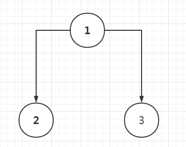

# 树的演变

  本文会和你介绍树的演变过程，从二叉树->二叉查找树->平衡二叉树(AVL树)->b-树->b+树（MySQL索引）->红黑树（BR树，1.8HashMap，这里可以提一下23树，把23树对应红黑树来讲），以上并非是二叉树的演变过程，而是我从复杂程度过来区分的，所有的树都各有各的好处，接下去由我来分别介绍。


## 二叉树

​    我们经常谈论的树，都是以二叉树为起点，然后添加各种规则去实现查找时间或者空间的减少。二叉树，是很平常的一颗“倒过来”的树，单单用来存储数据，如下图，因为不涉及查找，所以数字可以乱放：



  然后我们来手写一个树的类，来模拟一下这个二叉树：

```java

```

