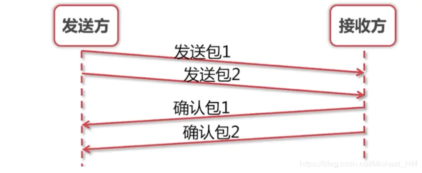
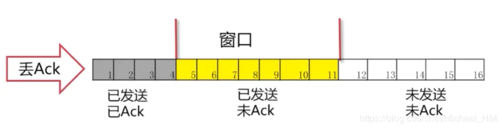

# 面试常见计算机网络问题

## 1、OSI七层协议、TCP/IP四层协议和五层协议模型

## OSI七层协议

| OSI层      | 功能                                   | TCP/IP协议                  |
| :--------- | :------------------------------------- | :-------------------------- |
| 应用层     | 文本传输，电子邮件，文件服务，虚拟终端 | FTP,HTTP,SNMP,DNS等         |
| 表示层     | 数据格式化，代码转换，数据加密         | 没有协议                    |
| 会话层     | 解除或建立与其他节点的联系             | 没有协议                    |
| 传输层     | 提供端对端的接口                       | TCP,UDP                     |
| 网络层     | 为数据包选择路由                       | IP,ICMP,RIP,OSPF,BGP,IGMP   |
| 数据链路层 | 传输有地址的帧，错误检测功能           | SLIP,CSLIP,PPP,ARP,RARP,MTU |
| 物理层     | 以二进制数据形式在物理媒体上传输数据   | ISO2110,IEEE802,IEEE802.2   |

以上是七层协议，业界还产生出了一些其他协议模型。例如TCP/IP四层协议以及五层协议。 

## TCP/IP四层协议模型：

主要包括：

- 应用层
- 传输层
- 网络层
- 物理链路层

## 五层协议模型

主要包括：

- 应用层
- 传输层
- 网络层
- 数据链路层
- 物理层 

示例图：

## 2、http 经历的七个阶段

   建立 TCP 连接->浏览器发送请求行->浏览器发送请求头->服务器发送状态码->服务器发送响应头->服务器发送响应数据->断 TCP 连接。

## 3、HTTPS 工作原理 

1、浏览器请求 https 网址，得到证书（公钥）。 

2、浏览器生成随机数，使用公钥加密随机数，加密摘要作为 RSA 证书一起发送给服务器。 

3、服务器使用私钥解密，解密完毕后得到随机数，此时的随机数成为了新的私钥。 

4、服务器将要发送的信息和服务器私钥通过对称加密发送给浏览器，完成了请求。 

https://blog.csdn.net/sean_cd/article/details/6966130

## 4、Tcp/IP 三次握手： 

SYN(synchronous 建立连接) 

ACK(acknowledgement 确认) 

Sequence number(顺序号码) 

1、浏览器发送数据包给服务器，数据包里面包含 SYN=1(表示建立连接)，Seq（身份码） 

2、服务器发送数据包给浏览器，数据包包含 ACK=1（表示确认建立连接）， ack=seq+1（表 

示确认身份）和 SYN=1(表示建立连接)，Seq（身份码） 

3、浏览器发送数据包给服务器，数据包包含 ACK=1,ack=seq+1，完成建立连接。 

## 5、Tcp/IP 四次挥手： 

1、浏览器发送数据包给服务器，数据包里面包含 FIN=1（请求断开连接），Seq（身份码） 

2、服务器发送数据包给浏览器，数据包含 ACK=1（表示确认断开连接）,ack=Seq+1（表示确 

认身份）和自己的 Seq（身份码），此时处于等待关闭状态。 

3、服务器发送数据包给浏览器，数据包含 FIN=1（请求断开连接）和自己的 Seq（身份码）， 

此时处于最后确认状态。 

4、浏览器发送数据包给服务器，数据包含 ACK=1（表示确认断开连接）和 ack=Seq+1，此时 

连接关闭。https://www.cnblogs.com/xuexianqi/p/13493126.html 

## 6、从浏览器输入地址到响应的整个过程(越详细越好，这个问题可以涵盖整个计算机网络 

了) 

1，DNS 解析（分别从浏览器缓存，本地 host 文件，本地 DNS 服务器，根 DNS 服务器） 

2，建立 TCP 连接（得知服务器的 ip 和端口后，用 socket 通过三次握手建立 tcp 连接） 

3，用户发送请求和服务器响应请求 

4，断开连接（四次挥手断开连接） 

 

## 7、滑动窗口协议

  滑动窗口协议是为了解决网络传输不可靠的问题而出现的。

### 滑动窗口协议：

- TCP协议的使用
- 维持发送方/接收方缓冲区 缓冲区是 用来解决网络之间数据不可靠的问题，例如丢包，重复包，出错，乱序

在TCP协议中，发送方和接受方通过各自维护自己的缓冲区。通过商定包的重传机制等一系列操作，来解决不可靠的问题。

### 问题一：如何保证次序？

> 提出问题：在我们滑动窗口协议之前，我们如何来保证发送方与接收方之间，每个包都能被收到。并且是按次序的呢？

发送方发送一个包1，这时候接收方确认包1。发送包2，确认包2。就这样一直下去，知道把数据完全发送完毕，这样就结束了。那么就解决了丢包，出错，乱序等一些情况！同时也存在一些问题。问题：吞吐量非常的低。我们发完包1，一定要等确认包1.我们才能发送第二个包。

### 问题二：如何提高吞吐量？

> 提出问题：那么我们就不能先连发几个包等他一起确认吗？这样的话，我们的速度会不会更快，吞吐量更高些呢？

如图，这个就是我们把两个包一起发送，然后一起确认。可以看出我们改进的方案比之前的好很多，所花的时间只是一个来回的时间。接下来，我们还有一个问题：改善了吞吐量的问题

### 问题三：如何实现最优解？

> 问题：我们每次需要发多少个包过去呢？发送多少包是最优解呢？

我们能不能把第一个和第二个包发过去后，收到第一个确认包就把第三个包发过去呢？而不是去等到第二个包的确认包才去发第三个包。这样就很自然的产生了我们"滑动窗口"的实现。

在图中，我们可看出灰色1号2号3号包已经发送完毕，并且已经收到Ack。这些包就已经是过去式。4、5、6、7号包是黄色的，表示已经发送了。但是并没有收到对方的Ack，所以也不知道接收方有没有收到。8、9、10号包是绿色的。是我们还没有发送的。这些绿色也就是我们接下来马上要发送的包。 可以看出我们的窗口正好是11格。后面的11-16还没有被读进内存。要等4号-10号包有接下来的动作后，我们的包才会继续往下发送。

#### 正常情况

可以看到4号包对方已经被接收到，所以被涂成了灰色。“窗口”就往右移一格，这里只要保证“窗口”是7格的。 我们就把11号包读进了我们的缓存。进入了“待发送”的状态。8、9号包已经变成了黄色，表示已经发送出去了。接下来的操作就是一样的了，确认包后，窗口往后移继续将未发送的包读进缓存，把“待发送“状态的包变为”已发送“。

#### 丢包情况

有可能我们包发过去，对方的Ack丢了。也有可能我们的包并没有发送过去。从发送方角度看就是我们没有收到Ack。

发生的情况：一直在等Ack。如果一直等不到的话，我们也会把读进缓存的待发送的包也一起发过去。但是，这个时候我们的窗口已经发满了。所以并不能把12号包读进来，而是始终在等待5号包的Ack。

> 如果我们这个Ack始终不来怎么办呢？

#### 超时重发

这时候我们有个解决方法：`超时重传` 这里有一点要说明：这个Ack是要按顺序的。必须要等到5的Ack收到，才会把6-11的Ack发送过去。这样就保证了滑动窗口的一个顺序。

这时候可以看出5号包已经接受到Ack，后面的6、7、8号包也已经发送过去已Ack。窗口便继续向后移动。